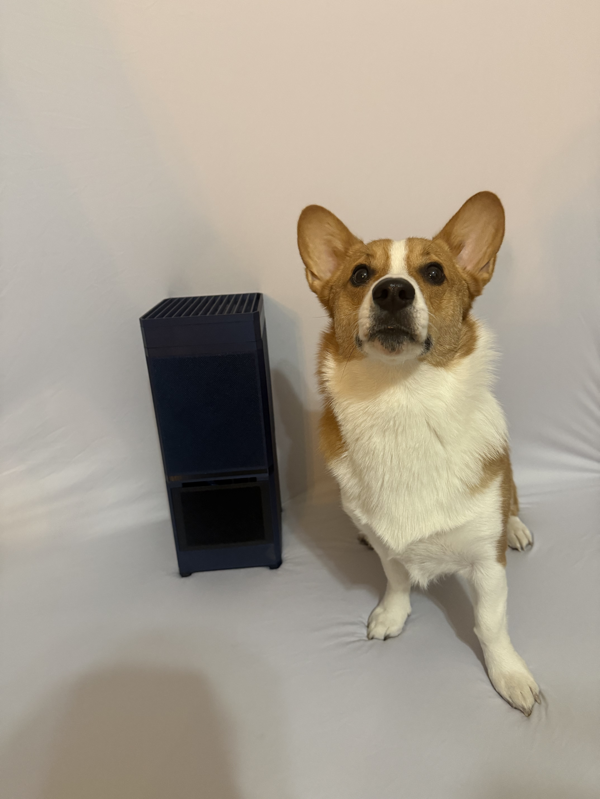
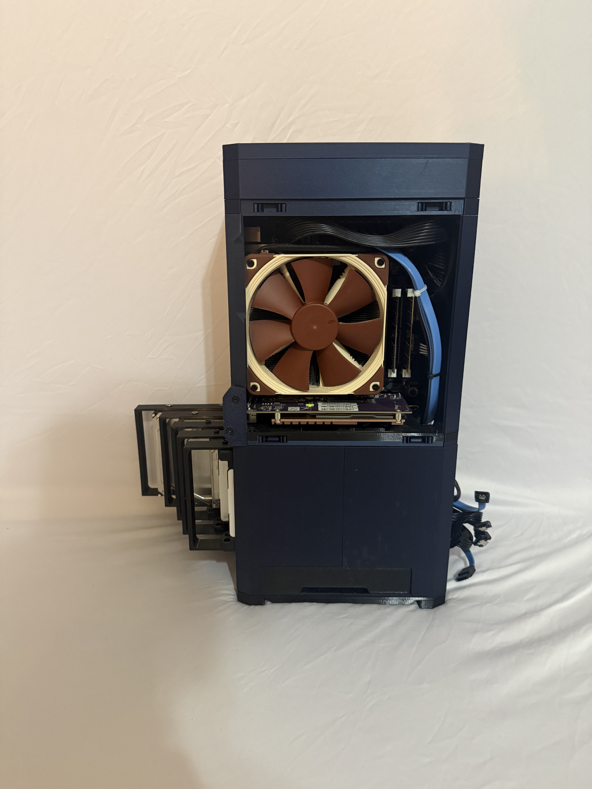
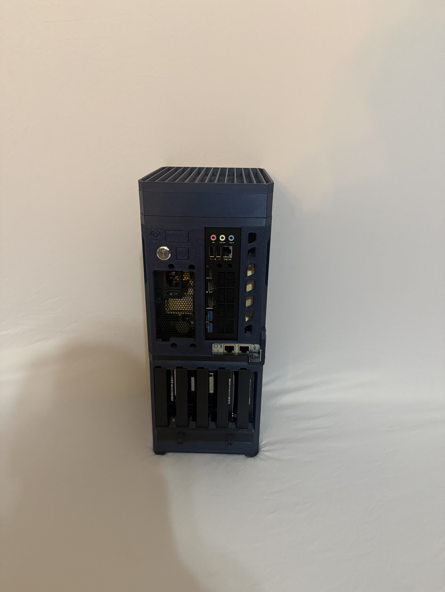

# 🖨️ 3D-Printed Custom Mini-PC TrueNAS Build

*Final assembled NAS enclosure (Corgi for scale).*

## 1. Overview & Inspiration
Off-the-shelf NAS boxes are fine if you just want a place to drop files, but I needed something that could actually pull its weight in my homelab. I was looking for a setup capable of handling my general network storage, streaming media through a Jellyfin server, spinning up a few VMs, and acting as a reliable sandbox for my cyber and networking side projects. 

This repository documents how I put together a custom 3D-printed Small Form Factor (SFF) PC running TrueNAS to hit all those marks without blowing my budget. It was an incredibly fun project, and I highly recommend doing a custom build like this yourself—well, *cough cough*, maybe once RAM prices drop. I managed to get my memory right before the current RAM crisis hit, so your mileage on the "budget-conscious" part might vary right now!

**Project Inspiration & Credits:** 
*   **Hardware Haven:** Credit to the YouTube channel Hardware Haven. Their video, [*This 3D-Printed Home Server Is INCREDIBLE*](https://youtu.be/i3G_LvowBkI?si=91bIQ_A8cXWfRrhW), was the main blueprint and motivation to actually pull the trigger on this build. 
*   **Enclosure Design:** The 3D files for the case are the [MASS - Stackable NAS ITX Enclosure](https://modcase.com.au/products/nas?srsltid=AfmBOoqVngkywpRymVcZIYHDWfh9uJF7jblUkSVucGPfCA4IZMH79yzK), which I grabbed from Modcase for $30.00 USD.

---

## 2. Bill of Materials (Hardware & Purchases)
Below is the complete breakdown of all parts utilized for the enclosure fabrication, cooling, and the internal PC build.

| Category | Item | Purpose / Notes |
| :--- | :--- | :--- |
| **3D Printing** | [Flashforge Adventurer 5M](https://a.co/d/00YIra72) | Used to fabricate the main chassis, drive cages, and fan modules. |
| **3D Printing** | [Dark Blue PETG](https://a.co/d/0dnJKtc3) | Main body of the NAS case. (Highly recommend buying 2 spools if you are new to 3D printing to account for misprints!) |
| **3D Printing** | [Black PETG](https://a.co/d/07EWdmw9) | Used specifically for the HDD storage bays for a clean two-tone color aesthetic. |
| **Case Hardware** | [M5 Screws & Bolts Assortment](https://a.co/d/0ja87DbK) | Used for mounting the motherboard securely to the 3D-printed standoffs. |
| **Case Hardware** | [Self-Tapping Case Screws](https://a.co/d/06ilbYNv) | Used to assemble and secure the various 3D-printed case panels together. |
| **Case Hardware** | [Zip Ties](https://a.co/d/00csjYNW) | Absolutely essential for cable management in such a tight ITX enclosure. |
| **PC Components** | [Minisforum Mini-ITX Motherboard/CPU Combo](https://a.co/d/0ctXo52u) | An insane all-in-one embedded board acting as the core compute unit for the server. |
| **PC Components** | [64GB DDR5 SODIMM RAM](https://a.co/d/0aUtl9Gl) | High-capacity memory required to handle ZFS caching, virtualization, and side projects. |
| **PC Components** | [QNAP QM2-2P2G2T Expansion Card](https://www.qnap.com/en/product/qm2-2p2g2t) | A badass find—adds 2x PCIe Gen3 M.2 NVMe SSD slots and 2x 2.5GbE ports to massively upgrade performance and networking. |
| **PSU** | [SFX Modular Power Supply](https://a.co/d/07sb6UsP) | Compact form factor PSU to clean up cable management inside the tiny case footprint. |
| **Accessories** | [16mm Metal Power Button](https://a.co/d/0fBQRLgI) | Plugs into the front panel for a clean, premium power switch. |
| **Cooling** | [Noctua 140mm Premium Fans (x3)](https://a.co/d/0aFWpLIR) | Industrial-grade cooling split up into 3 zones: 1 for the main PC components, 1 at the top to pull out hot exhaust, and 1 dedicated to keeping the HDD storage array chilled. |
| **Storage** | [Insert e.g., 4x WD Blue 4TB HDDs] | Primary storage drives configured in a TrueNAS pool. |
| **Storage** | [Insert Boot Drive / NVMe] | Dedicated OS drive for TrueNAS. |
| **Cooling** | Noctua Low-Profile CPU Cooler | Provided adequate CPU cooling within the tight clearance of the ITX chassis. |
| **Cooling** | [Insert Case Fans, e.g., 140mm] | Primary intake/exhaust to ensure ambient airflow over the storage arrays. |

---

## 3. The Enclosure Fabrication
*Insert any notes here about how long the print took, what slicer settings you used, or any warping issues you had to overcome.*

## 4. PC Assembly & Configuration

*Motherboard mounting and Noctua cooler clearance.*

*   **Internal Assembly:** *Talk about fitting the motherboard, routing the power cables, and any tight clearances.*
*   **Drive Installation:** *Explain how the drives slide into the rear of the enclosure.*

*Rear view showcasing the exposed drive bays, I/O shield, and power supply mount.*

## 5. Final Thoughts & Lessons Learned
*   What was the hardest part of the physical build? 
*   Did you run into any heat or clearance issues once TrueNAS was booted up and the drives were spinning?
